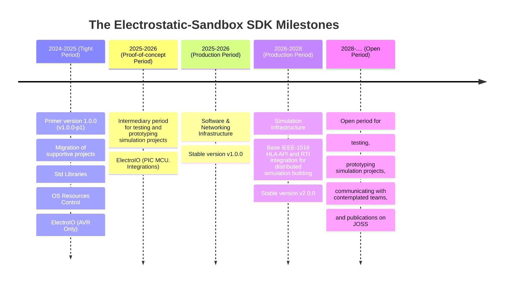

#  The Electrostatic-Sandbox SDK

> 

## Preface and terminology:

**_The Electrostatic-Sandbox SDK_** is a complete work-in-progress Software Development Suite written purely in ISO GNU/C99 with stock Java bindings with a software distributed simulation engineering interface based on the IEEE-1516 High-level Architecture (HLA), and the National Aeronautics and Space Administration Distributed space exploration simulation system (NASA DSES).

**_Electrobox_** is an electronic monstrosity workstation designed to examine and develop systems for distributed simulations by providing an integrated environment housing the basic nostalgic communication protocols (i.e., Serial and Parallel COMs), the abstract networking interfaces, and a range of other electronic modules providing standards for controller interfaces, and sensor modules (e.g., the underdeveloped ShiftAvr, and Arduinos). 

This electronic monstrosity features and leverages a powerful system-engineering infrastructure framework, the _Electrostatic-Sandbox Framework_ for distributed simulation systems, a complete SDK suite written purely in C programming language with a JNI binding based on the IEEE-1516 HLA Spec. and NASA DSES.

_[Jump to the Electrobox Specification](https://github.com/Electrostat-Lab/Electrostatic-Sandbox/blob/master/embedded-system-design/electrobox/README.md)_

## Provisional Software/Hardware Specification: 

### Provisional Hardware/Software Abstraction Layer (HAL):

The _HAL_ is a type of software hierarchial architectural design that provides generic Application Programming Interfaces for the system as abstractions with replaceable infrastructure. The _Infrastructure_ is decomposed into major bulky parts _Networking Infrastructure_, _Software Infrastructure_, and _Simulation Infrastructure (aka. IEEE-1516 HLA RTI)_. Each infrastructure is further decomposed into finer components that operate on a specific resource. _System Resources_ are either OS Resources, Hardware Resources, or Simulation Resources. Development phases are created by introducing a milestone, the milestone operates on one or more of the major bulky _infrastructures_ and brings decomposed features to the SDK gradually until the milestone is achieved.

* Simplified Paradigm:

```mermaid
block-beta
columns 1
  block:IEEE
    _IEEE["IEEE-1516 HLA (Simulation Infrastructure)"]
  end
  block:__IEEE
    RTI_IEEE["IEEE-1516 RTI"]
    FED_IEEE["RTI Federates"]
    FOM_IEEE["FOM"]
  end
  block:MIG
    _MIG["Migrated APIs and Frameworks"]
  end
  block:MIG_APIs
      SERIAL["Serial4j"]
      JECTOR["Jector"]
      ART["Articular-ES"]
      JME["Jme-alloc"]
      JSNAP["jSnapLoader"]
      AUTO["Automata4j"]
  end
  NETSOFT_INFRA["Networking and Software Infrastructure"]
  OS_RES["Base OS Resources and Std Libraries APIs"]
  block:TITLE
    block:STD
      Std["Std Libs"]
    end
    block:OS
      OSRES["Base OS Resources"]
    end
  end
  block:HAL
    block:_STD
      ADT["ADTs"]
      _STD_CONT["..."]
    end
    block:_OS
      FS["Abstract Filesystems"]
      _OS_CONT["..."]
    end
  end

  block:INFRA
      _INFRA["Hardware Infrastructure"]
  end
  block:ELECTROIO
      _ELECTROIO["ElectroIO (formerly ShiftAvr)"]
  end
  block:__ELECTROIO
      GPIO["GPIO"]
      UART["USART"]
      ADC["ADC"]
      CONT["..."]
  end
  MCU["Microcontrollers Toolchains Binaries"]

  style INFRA fill:#000,stroke:#999
  style ELECTROIO fill:#000,stroke:#999
  style __ELECTROIO fill:#000,stroke:#999
  style MCU fill:#000,stroke:#999

  style MIG fill:#999,stroke:#999
  style MIG_APIs fill:#999,stroke:#999

  style NETSOFT_INFRA stroke:#333
  style OS_RES stroke:#333

  style OS fill:#969,stroke:#333
  style STD fill:#999,stroke:#333
  style _OS fill:#969,stroke:#333
  style _STD fill:#999,stroke:#333
```

* Detailed Architecture:

```mermaid
block-beta
columns 1
  block:IEEE
    _IEEE["IEEE-1516 HLA (Simulation Infrastructure)"]
  end
  block:MIG
    _MIG["Migrated APIs and Frameworks"]
  end
  block:MIG_APIs
      SERIAL["Serial4j"]
      JECTOR["Jector"]
      ART["Articular-ES"]
      JME["Jme-alloc"]
      JSNAP["jSnapLoader"]
      AUTO["Automata4j"]
  end
  OS_Res["Base OS Resources and Std Libraries APIs (Networking and Software Infrastructure)"]
  block:TITLE
    block:STD
      Std["Std Libs"]
    end
    block:OS
      OSRES["Base OS Resources"]
    end
  end
  block:HAL
    block:_STD
      ADT["ADTs"]
      ALG["Algebra"]
      ALGO["Algorithms"]
    end
    block:_OS
      FS["Abstract Filesystems"]
      TH["Thread Control Utilities"]
      SCT["Sockets Control Utilities"]
      PC["Processes Control Utilities"]
      LOG["Logging Utilities"]
      MEM["Memory Allocation Utilities"]
      MEM_INS["Memory Inspection Utilities"]
      MEM_CTRL["Memory Control Utilities"]
      CRY["Cryptographic Utilities"]
      DB["Base Databases"]
    end
  end
  block:ELECTROIO
      _ELECTROIO["ElectroIO (formerly ShiftAvr)"]
  end
  MCU["Microcontrollers Toolchains Binaries"]

  style MIG fill:#999,stroke:#999
  style MIG_APIs fill:#999,stroke:#999
  style ELECTROIO fill:#999,stroke:#999

  style OS fill:#969,stroke:#333
  style STD fill:#999,stroke:#333
  style _OS fill:#969,stroke:#333
  style _STD fill:#999,stroke:#333
```

### Project Milestones:

> [!IMPORTANT]
> **Migration Milestones:**
> - [x] Migrating Serial4j to the project.
> - [ ] Migrating ShiftAvr to the project.
> - [ ] Migrating jSnapLoader to the project.
> - [ ] Migrating Automata4j to the project.
> - [ ] Migrating Jector to the project.

> [!IMPORTANT]
> **Primer version 1.0.0 (v1.0.0-p1) _"The Base OS Resources Control APIs"_:**
> - [ ] Low-level Abstract Data types (ADTs).
> - [ ] Low-level popular text-manipulation algorithms.
> - [ ] Low-level popular switching algebra algorithms.
> - [ ] Low-level popular elementary algebra algorithms.
> - [ ] Low-level popular transcendental algebra algorithms.
> - [ ] Abstract filesystem utilities.
> - [ ] Thread control utilities and interface.
> - [ ] Sockets control utilities and interface.
> - [ ] Process control utilities and interface.
> - [ ] Logging Utilities.
> - [ ] Memory Allocation Utilities.
> - [ ] Memory Inspection Utilities.
> - [ ] Memory Control Utilities.
> - [ ] Crytographic utilities and interfaces.
> - [ ] Base System Databases utilities and interfaces.
> - [ ] ElectroIO for AVR MCUs (formerly ShiftAvr).

**Stable version v1.0.0 _"The Base OS Resources Control APIs"_.**
> ...

**Stable version v2.0.0 _"The Base IEEE-1516 HLA API and RTI integration"_.**

### Challenges:
- Building the appropriate HAL on top of the low-level OS resources and communication protocols.
- Handling security and network firewall dilemmas.
- Recruiting developers for open-source sofware engineering.
- Working in a multi-disciplinary environment of both software, hardware engineering perspectives and managing the interactions between them.

### Major End-goals:
- The capability to build a complete distributed system on top of a GNU/Linux in a sandboxed environment bearing in mind all the perspective of truely performant software (e.g., concurrency, security, reliability, failure handlers, ...etc).
- Connecting to peripheral digital/analog devices via simulation interfaces in a sandboxed environment (Hardware/Software Co-design).
- Simulating large Space Missions into small finite simulations (e.g., Rocket Launch, Rocket separation stages, Nose separation, Rocket Launch Abort, and Rocket Engine Failure).
- Building in-home, office, and outdoor distributed IoT projects (e.g., Smart Homes, Smart Hospitals, Switch Control Military and Traffic control systems).

## General progress:
**API used:**
- [x] Serial4j.
- [x] Articular-ES.
- [x] Automata4j.
- [x] Jector.
- [ ] ShiftAvr.
- [ ] Parallel4j.
- [ ] Socket4j.
- [x] Electrostatic-sandbox-framework.

**Environment Setup**:
- [x] `setup-tools` scripting.
- [x] `setup-framework` scripting.

**Electrostatic-sandbox framework**:
- [ ] Electroserial API: wraps Serial4j API providing a generic boundary to the Electrocomponent API.
- [ ] Electroparallel API: wraps Parallel4j API providing a generic boundary to the Electrocomponent API.
- [ ] Electrosocket API: wraps Socket4j API providing a generic boundary to the Electrocomponent API.
- [ ] Electrocomponent API: provides the vertical HAL for interacting with devices through device managers based on the scientific model provided by the _Set Theory_.
- [x] Electrostatic-sandbox-examples: examples and techdemos utilizing the HAL API directly to interact with peripheral devices and/or use one of the above core APIs.
- [ ] Deployment to Maven Central.
- [ ] Build the framework into an SDK.

## References (Direct links to useful topics):
### Operational:
- [GNU/Linux glibc reference manual on terminal I/O](https://sourceware.org/glibc/manual/latest/html_mono/libc.html#Low_002dLevel-Terminal-Interface)
- [GNU/Linux glibc reference manual on low-level I/O](https://sourceware.org/glibc/manual/latest/html_mono/libc.html#Low_002dLevel-I_002fO)
- [Linux Kernel Userspace APIs](https://docs.kernel.org/userspace-api/index.html#the-linux-kernel-user-space-api-guide)
- [Linux Manual Page Generic IO using IOCTL](https://man7.org/linux/man-pages/man2/ioctl.2.html)
- [Linux Generic IOCTL Functions to control data routing](https://git.kernel.org/pub/scm/linux/kernel/git/torvalds/linux.git/tree/include/uapi/asm-generic/ioctl.h)
- [Linux Manual Page Serial IOCTL](https://man7.org/linux/man-pages/man2/ioctl_tty.2.html)
- [Linux Serial IOCTL Magic Macros](https://git.kernel.org/pub/scm/linux/kernel/git/torvalds/linux.git/tree/include/uapi/asm-generic/termios.h)
- [Linux Parallel IOCTL Magic Macros](https://git.kernel.org/pub/scm/linux/kernel/git/torvalds/linux.git/tree/include/uapi/linux/parport.h)
- [Linux IOCTL CDROM Magic Macros](https://git.kernel.org/pub/scm/linux/kernel/git/torvalds/linux.git/tree/include/uapi/linux/cdrom.h)
- [Linux IOCTL PCI-e Magic Macros](https://git.kernel.org/pub/scm/linux/kernel/git/torvalds/linux.git/tree/include/uapi/linux/pci.h)
- [Linux IOCTL USB FS Magic Macros](https://git.kernel.org/pub/scm/linux/kernel/git/torvalds/linux.git/tree/include/uapi/linux/usbdevice_fs.h)
- [Linux Kernel Test Hashing](https://git.kernel.org/pub/scm/linux/kernel/git/torvalds/linux.git/tree/lib/test_hash.c)

### Theoretical papers:
- [TWOs Discrete Event Simulation]()
- [VME TWOs Discrete Event Simulation]()
- [NASA Distributed System simulation]()
- [C/C++ IBM Language Reference](https://www.ibm.com/docs/pt/i/7.5?topic=reference-pdf-file-ile-cc-language)
- [GNU C Language Reference Manual](https://www.gnu.org/software/gnu-c-manual/gnu-c-manual.pdf)
- [GCC Compiler Reference Manual](https://gcc.gnu.org/onlinedocs/)
- [libstdc++ Reference Manual](https://gcc.gnu.org/onlinedocs/gcc-7.5.0/libstdc++-manual.pdf.gz)
- [GNU libc Reference Manual](https://sourceware.org/glibc/manual/latest/pdf/libc.pdf)
- [Java-20 APIs Documentation Oracle](https://docs.oracle.com/en/java/javase/20/docs/api/index.html)
- [Java-20 JNI API Documentation](https://docs.oracle.com/en/java/javase/20/docs/specs/jni/index.html)
- [Java-20 Language Reference Oracle](https://docs.oracle.com/javase/specs/jls/se20/jls20.pdf)
- [Java-20 VM Oracle](https://docs.oracle.com/javase/specs/jvms/se20/jvms20.pdf)
- [NASA C/C++ Native Coding Style](https://ntrs.nasa.gov/citations/20080039927)
- [Java Google Coding Style](https://google.github.io/styleguide/javaguide.html)
- [Ubuntu-bionic Internals]()

### Technical Books:
- [Serial Port Complete by Jan Axelson's](http://janaxelson.com/spc.htm)
- [Parallel Port Complete by Jan Axelson's](http://janaxelson.com/parprtib.htm)
- [USB Complete by Jan Axelson's](http://janaxelson.com/usbc.htm)
- [USB Embedded Hosts Complete by Jan Axelson's](http://janaxelson.com/usb_embedded_hosts.htm)
- [USB Mass Storage Complete by Jan Axelson's](http://janaxelson.com/usbms.htm)
- [Embedded Ethernet and Internet Complete by Jan Axelson's](http://janaxelson.com/eec.htm)
- [The Microcontroller Idea Book](http://janaxelson.com/microcib.htm)
- [Making Printed Circuit Boards](http://janaxelson.com/makpcbds.htm)
- [PCI-e Programming]()
- [AVR Microcontroller Programming]()
- [In-serial Programmer software protocol]()
- [Parallel Programmer software protocol]()

### Credits:
Credits should go to these products and platforms for being open-source and widely available with no constraints, hooray to them:
- The Java Platform.
- Oracle Corporation.
- The CMake Building Framework.
- The jMonkeyEngine game engine.
- The Gradle API.
- The Android Studio IDE.
- The Jetbrains Fleet Code Editor.
- The GraalVM team.
- The Linux Kernel.
- The GNU/Linux Operating Systems.
- The Avrdude tool.
- The Arduino Platform.
- The OpenAI API (GPT-3) mainly for scripting and project management.
- The Gigabyte Company (not open-source, but the main board depends on).
- Zorin OS (the main OS currently in-use).
- SanDisk (flash drive).
- Microchip & ATMEL (for AVR microcontrollers).
- The Linux Man Page & Micheal Kerrisk's Linux Interfacing Book.
- The GNU/Linux glibc and the interfacing libraries.
- IEEE for providing the standards of I/O Communication interfaces.
- The Universal Serial Bus (USB) Corporation.
- The Microsoft Corp. for providing VsCode, an easy-to-use code editor.
- The Jetbrains Corp. for providing Intellij-IDEA IDE.
- The NASA Technical Reports Server (NTRS) for providing open publications from their distributed simulation systems.
- Maven Central, Sonatype and JIRA services for hosting open-source APIs.
- Springer Nature for providing Mathematics books and publications on predicate calculus and logic analysis.
- The ACM digital library for providing publications about distributed simulation systems.
- The GitHub Platform and Git VCS for hosting this project.
- The KiCad project.
- The Fritzing project.

And, To others who I didn't mention, and were essential predicates for the success of this project.
