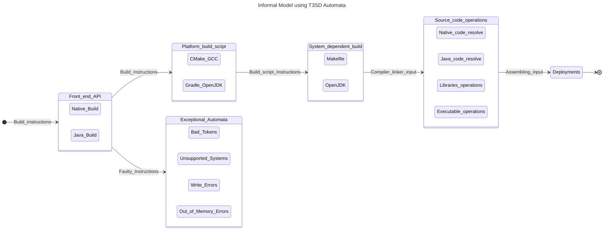

# The Electrostatic Sandbox Framework building architecture

## Preface:
Essentially, the build architecture of the Electrostatic-Sandbox SDK is based on the idea of creating a _front-end_ scripted API that creates a _building automata_, which entails taking an input and passing into a chain of states, and eventually ending with a terminal state; thus the recognition of the machine to the building holds if the terminal state is being reached by the program counter. The initial input to the automata is mainly a `building routine instruction` and the outputs are proceeded and could be found at the filesystems `cmake-build` and `build`, where the terminal output is produced.

## First-order formal logic using automatas:
Let _F_ be a front-end API, _P_ be the platform build script API, _I_ be the input, _q_ be a machine state; such that, a function _B_ produces a build by relating the domain of _F_ to the co-domain of _P_ resulting in $q_f$ which is the accepting state.

* Formal:
$$F = [P(Q) | d(P(Q), I) \land P(P) \implies P(B)]$$ ;where _P(S)_ is the power-set of some set S, and $d(..., ...)$ is a transition function that yields the accepting states out of _P(Q)_ using some input _I_.

* The transition function: $$d(P(Q), I): P(Q)\ x\ I \rightarrow P(Q) \iff [Q = Q_{system} \vee Q_{execeptional}]$$ ;thus, this transition implies that this automata is a non-deterministic, if and only if the set Q contains both the normal program flow $Q_{system}$ states, and the exceptional program flow states $Q_{exceptional}$. 

* English: Let _F_ denotes the front-end API enclosing subsets of the system states _Q_ (i.e., subsets of the power set Q); such that the occurrence of subsets of the system states with subsets of the platform scripts yields build parts. 

## The possible exceptional automatas:
Exceptional automatas arise in a variety of conditions, examples are a _disjunction_ of the following:
* Bad non-processable input tokens to the front-end delegator API.
* Unsupported Toolchains.
* Compile-time errors.
* Non-writable filesystems.
* Out-of-memory filesystems.

## Deduced Architecture using SES-Modelling and T3SD:

> [!NOTE]
> The following is a simplified script for the procedure using a simple Automata model:
> [POWER-SET OF AVAILABLE SYSTEMS] i=(SUBSETS OF THE SYSTEMS' POWER-SET)--> [FRONT-END DELEGATOR API] --> [PLATFORM-INDEPENDENT BUILD SCRIPT] i=(PLATFORM-SCRIPT)--> [PLATFORM TOOLCHAIN] i=(OBJECT-FILES)--> [BUILD AUTOMATA] 
>

