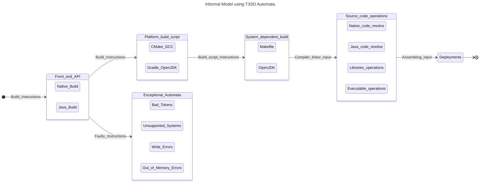

# The Electrostatic Sandbox Framework building architecture

## Preface:
Essentially, the build architecture of the Electrostatic-Sandbox SDK is based on the idea of creating a _front-end_ scripted API that creates a _building automata_, which entails taking an input and passing into a chain of states, and eventually ending with a terminal state; thus the recognition of the machine to the building holds if the terminal state is being reached by the program counter. The initial input to the automata is mainly a `building routine instruction` and the outputs are proceeded and could be found at the filesystems `cmake-build` and `build`, where the terminal output is produced.

## First-order formal logic using automatas:
Let _F_ be a front-end API, _P_ be the platform build script API, _I_ be the input, _q_ be a machine state; such that, a function _B_ produces a build by relating the domain of _F_ to the co-domain of _P_ resulting in $q_f$ which is the accepting state.

* Formal:
$$F = [P(Q) | d(P(Q), I) \land P(P) \implies P(B)]$$ ;where _P(S)_ is the power-set of some set S, and $d(..., ...)$ is a transition function that yields the accepting states out of _P(Q)_ using some input _I_.

* The transition function: $$d(P(Q), I): P(Q)\ x\ I \rightarrow P(Q) \iff [Q = Q_{system} \vee Q_{execeptional}]$$ ;thus, this transition implies that this automata is a non-deterministic, if and only if the set Q contains both the normal program flow $Q_{system}$ states, and the exceptional program flow states $Q_{exceptional}$. 

* English: Let _F_ denotes the front-end API enclosing subsets of the system states _Q_ (i.e., subsets of the power set Q); such that the occurrence of subsets of the system states with subsets of the platform scripts yields build parts. 

## The possible exceptional automatas:
Exceptional automatas arise in a variety of conditions, examples are a _disjunction_ of the following:
* Bad non-processable input tokens to the front-end delegator API.
* Unsupported Toolchains.
* Compile-time errors.
* Non-writable filesystems.
* Out-of-memory filesystems.

## Deduced Architecture using SES-Modelling and T3SD:

> [!NOTE]
> The following is a simplified script for the procedure using a simple Automata model:
> [POWER-SET OF AVAILABLE SYSTEMS] i=(SUBSETS OF THE SYSTEMS' POWER-SET)--> [FRONT-END DELEGATOR API] --> [PLATFORM-INDEPENDENT BUILD SCRIPT] i=(PLATFORM-SCRIPT)--> [PLATFORM TOOLCHAIN] i=(OBJECT-FILES)--> [BUILD AUTOMATA] 
>


## The project filesystem tree: 
The project is essentially a native project (C/C++) with a Java binding module (electrostatic4j):
* The Native modules are:
    - `electrostatic-core`
    - `electrostatic-examples`
* The Java modules inside the `electrostatic4j` are subprojects:
    - `electrostatic4j-core`
    - `electrostatic4j-native`
    - `serial4j`
    - `arithmos`

> [!NOTE]
> The idea of using `electrostatic` primer sources has emerged as a result of the lackness of the functional requirements and system-wide vision. It basically acts as a testing preliminary container before merging into the main source library.

<details>
  <summary>The following are the user-active filesystem tree generated for the electrostatic-core module:</summary>
    
```bash
├── src
│   ├── include
│   │   └── electrostatic
│   │       ├── algorithm
│   │       │   ├── arithmos
│   │       │   │   ├── adt
│   │       │   │   │   ├── list.h
│   │       │   │   │   ├── map.h
│   │       │   │   │   ├── queue.h
│   │       │   │   │   └── stack.h
│   │       │   │   ├── algebra
│   │       │   │   │   └── switching.h
│   │       │   │   ├── list
│   │       │   │   │   ├── contiguous_buffer.h
│   │       │   │   │   └── linked_buffer.h
│   │       │   │   ├── memory
│   │       │   │   │   └── patcher.h
│   │       │   │   ├── queue
│   │       │   │   │   ├── concurrent_linked_queue.h
│   │       │   │   │   └── linked_queue.h
│   │       │   │   ├── README.md
│   │       │   │   └── vectorspaces
│   │       │   │       ├── coordinate.h
│   │       │   │       └── vector2d
│   │       │   │           └── vector2d.h
│   │       │   ├── automata
│   │       │   │   └── info.txt
│   │       │   ├── di
│   │       │   │   └── info.txt
│   │       │   └── ecs
│   │       │       └── info.txt
│   │       ├── comm
│   │       │   ├── comm.h
│   │       │   └── info.txt
│   │       ├── sys
│   │       │   ├── electrofs
│   │       │   │   └── info.txt
│   │       │   ├── electrohid
│   │       │   │   └── info.txt
│   │       │   ├── electromemory
│   │       │   │   └── info.txt
│   │       │   ├── electroparallel
│   │       │   │   └── info.txt
│   │       │   ├── electropci
│   │       │   │   └── info.txt
│   │       │   ├── electroserial
│   │       │   │   ├── info.txt
│   │       │   │   └── linux
│   │       │   │       └── info.md
│   │       │   ├── electrosockets
│   │       │   │   └── info.txt
│   │       │   └── electrousbfs
│   │       │       └── info.txt
│   │       └── util
│   │           ├── console
│   │           │   └── colors.h
│   │           ├── errno
│   │           │   └── errno.h
│   │           ├── loader
│   │           │   └── dll_loader.h
│   │           └── unit-testing
│   │               └── unit_test.h
│   └── libs
│       ├── electrostatic
│       │   ├── algorithm
│       │   │   ├── arithmos
│       │   │   │   └── info.txt
│       │   │   ├── automata
│       │   │   │   └── info.txt
│       │   │   ├── di
│       │   │   │   └── info.txt
│       │   │   └── ecs
│       │   │       └── info.txt
│       │   ├── comm
│       │   │   ├── info.txt
│       │   │   └── init_protocol.c
│       │   ├── platform
│       │   │   ├── android
│       │   │   │   └── sys
│       │   │   │       ├── electrofs
│       │   │   │       │   └── info.txt
│       │   │   │       ├── electrohid
│       │   │   │       │   └── info.txt
│       │   │   │       ├── electromemory
│       │   │   │       │   └── info.txt
│       │   │   │       ├── electroparallel
│       │   │   │       │   └── info.txt
│       │   │   │       ├── electropci
│       │   │   │       │   └── info.txt
│       │   │   │       ├── electroserial
│       │   │   │       │   └── info.txt
│       │   │   │       ├── electrosockets
│       │   │   │       │   └── info.txt
│       │   │   │       └── electrousbfs
│       │   │   │           └── info.txt
│       │   │   ├── linux
│       │   │   │   └── sys
│       │   │   │       ├── electrofs
│       │   │   │       │   └── info.txt
│       │   │   │       ├── electrohid
│       │   │   │       │   └── info.txt
│       │   │   │       ├── electromemory
│       │   │   │       │   └── info.txt
│       │   │   │       ├── electroparallel
│       │   │   │       │   └── info.txt
│       │   │   │       ├── electropci
│       │   │   │       │   └── info.txt
│       │   │   │       ├── electroserial
│       │   │   │       │   └── info.txt
│       │   │   │       ├── electrosockets
│       │   │   │       │   └── info.txt
│       │   │   │       └── electrousbfs
│       │   │   │           └── info.txt
│       │   │   └── mcu
│       │   │       └── info.txt
│       │   └── util
│       │       └── info.txt
│       └── electrostatic-primer
│           ├── algorithm
│           │   ├── arithmos
│           │   │   ├── algebra
│           │   │   │   └── switching
│           │   │   │       ├── switching_and.c
│           │   │   │       ├── switching_not.c
│           │   │   │       ├── switching_or.c
│           │   │   │       └── switching_xor.c
│           │   │   ├── info.txt
│           │   │   ├── list
│           │   │   │   ├── contiguous_buffer.c
│           │   │   │   ├── linked_buffer.c
│           │   │   │   └── list.c
│           │   │   ├── queue
│           │   │   │   ├── linked_queue.c
│           │   │   │   └── queue.c
│           │   │   └── vector2d
│           │   │       ├── vector2d_add.c
│           │   │       ├── vector2d_angle.c
│           │   │       ├── vector2d_are_dependent.c
│           │   │       ├── vector2d_are_parallel.c
│           │   │       ├── vector2d_are_perpendicular.c
│           │   │       ├── vector2d_cross_product.c
│           │   │       ├── vector2d_distance.c
│           │   │       ├── vector2d_divide.c
│           │   │       ├── vector2d_dot_product.c
│           │   │       ├── vector2d_extrapolate.c
│           │   │       ├── vector2d_interpolate.c
│           │   │       ├── vector2d_length.c
│           │   │       ├── vector2d_normalize.c
│           │   │       ├── vector2d_polar.c
│           │   │       ├── vector2d_product.c
│           │   │       ├── vector2d_scalar_add.c
│           │   │       ├── vector2d_scalar_divide.c
│           │   │       ├── vector2d_scalar_moduluo.c
│           │   │       ├── vector2d_scalar_multiply.c
│           │   │       ├── vector2d_scalar_subtract.c
│           │   │       └── vector2d_subtract.c
│           │   ├── automata
│           │   │   └── info.txt
│           │   ├── di
│           │   │   └── info.txt
│           │   └── ecs
│           │       └── info.txt
│           ├── comm
│           │   ├── info.txt
│           │   └── init_protocol.c
│           ├── platform
│           │   ├── android
│           │   │   └── sys
│           │   │       ├── electrofs
│           │   │       │   └── info.txt
│           │   │       ├── electrohid
│           │   │       │   └── info.txt
│           │   │       ├── electromemory
│           │   │       │   └── info.txt
│           │   │       ├── electroparallel
│           │   │       │   └── info.txt
│           │   │       ├── electropci
│           │   │       │   └── info.txt
│           │   │       ├── electroserial
│           │   │       │   └── info.txt
│           │   │       ├── electrosockets
│           │   │       │   └── info.txt
│           │   │       └── electrousbfs
│           │   │           └── info.txt
│           │   ├── linux
│           │   │   └── sys
│           │   │       ├── electrofs
│           │   │       │   └── info.txt
│           │   │       ├── electrohid
│           │   │       │   └── info.txt
│           │   │       ├── electromemory
│           │   │       │   └── info.txt
│           │   │       ├── electroparallel
│           │   │       │   └── info.txt
│           │   │       ├── electropci
│           │   │       │   └── info.txt
│           │   │       ├── electroserial
│           │   │       │   └── info.txt
│           │   │       ├── electrosockets
│           │   │       │   └── info.txt
│           │   │       └── electrousbfs
│           │   │           └── info.txt
│           │   └── mcu
│           │       └── info.txt
│           └── util
│               ├── info.txt
│               ├── loader
│               │   └── dll_loader.c
│               ├── logging
│               └── unit-testing
│                   └── unit_test.c
```
</details>

<details>
  <summary>The following are the user-active filesystem tree generated for the electrostatic4j module:</summary>
  
```shell
├── arithmos4j
│   ├── arithmos4j-core
│   │   ├── build.gradle
│   │   └── java
│   │       └── electrostatic4j
│   │           └── arithmos
│   │               └── HelloWorld.java
│   ├── arithmos4j-examples
│   │   ├── build.gradle
│   │   └── java
│   │       └── electrostatic4j
│   │           └── arithmos
│   │               └── HelloWorld.java
│   └── arithmos4j-native
│       ├── build.gradle
│       └── src
│           ├── include
│           │   └── jni
│           └── lib
│               └── jni
├── electrostatic4j-core
│   ├── build.gradle
│   └── src
│       └── main
│           └── java
│               └── electrostatic4j
│                   ├── NativeLibrary.java
│                   └── util
│                       └── loader
│                           ├── NativeImageLoader.java
│                           └── package-info.java
├── electrostatic4j-examples
│   ├── build.gradle
│   └── src
│       └── main
│           └── java
│               └── electrostatic4j
│                   └── examples
│                       └── Launcher.java
├── electrostatic4j-native
│   ├── build.gradle
│   ├── dependencies
│   │   ├── include
│   │   │   └── electrostatic
│   │   │       ├── algorithm
│   │   │       │   ├── arithmos
│   │   │       │   │   ├── adt
│   │   │       │   │   │   ├── list.h
│   │   │       │   │   │   ├── map.h
│   │   │       │   │   │   ├── queue.h
│   │   │       │   │   │   └── stack.h
│   │   │       │   │   ├── algebra
│   │   │       │   │   │   └── switching.h
│   │   │       │   │   ├── list
│   │   │       │   │   │   ├── contiguous_buffer.h
│   │   │       │   │   │   └── linked_buffer.h
│   │   │       │   │   ├── memory
│   │   │       │   │   │   └── patcher.h
│   │   │       │   │   ├── queue
│   │   │       │   │   │   ├── concurrent_linked_queue.h
│   │   │       │   │   │   └── linked_queue.h
│   │   │       │   │   ├── README.md
│   │   │       │   │   └── vectorspaces
│   │   │       │   │       ├── coordinate.h
│   │   │       │   │       └── vector2d
│   │   │       │   │           └── vector2d.h
│   │   │       │   ├── automata
│   │   │       │   │   └── info.txt
│   │   │       │   ├── di
│   │   │       │   │   └── info.txt
│   │   │       │   └── ecs
│   │   │       │       └── info.txt
│   │   │       ├── comm
│   │   │       │   ├── comm.h
│   │   │       │   └── info.txt
│   │   │       ├── sys
│   │   │       │   ├── electrofs
│   │   │       │   │   └── info.txt
│   │   │       │   ├── electrohid
│   │   │       │   │   └── info.txt
│   │   │       │   ├── electromemory
│   │   │       │   │   └── info.txt
│   │   │       │   ├── electroparallel
│   │   │       │   │   └── info.txt
│   │   │       │   ├── electropci
│   │   │       │   │   └── info.txt
│   │   │       │   ├── electroserial
│   │   │       │   │   ├── info.txt
│   │   │       │   │   └── linux
│   │   │       │   │       └── info.md
│   │   │       │   ├── electrosockets
│   │   │       │   │   └── info.txt
│   │   │       │   └── electrousbfs
│   │   │       │       └── info.txt
│   │   │       └── util
│   │   │           ├── console
│   │   │           │   └── colors.h
│   │   │           ├── errno
│   │   │           │   └── errno.h
│   │   │           ├── loader
│   │   │           │   └── dll_loader.h
│   │   │           └── unit-testing
│   │   │               └── unit_test.h
│   │   └── libs
│   │       ├── android
│   │       │   ├── aarch64-linux-android21
│   │       │   ├── armv7a-linux-androideabi21
│   │       │   ├── i686-linux-android21
│   │       │   └── x86_64-linux-android21
│   │       └── linux
│   │           ├── x86
│   │           │   ├── libelectrostatic-a.a
│   │           │   └── libelectrostatic.so
│   │           └── x86-64
│   │               ├── libelectrostatic-a.a
│   │               └── libelectrostatic.so
│   └── src
│       ├── include
│       │   └── jni
│       │       └── electrostatic4j_NativeLibrary.h
│       └── lib
│           └── jni
│               └── electrostatic4j_NativeLibrary.c
├── gradle
│   └── wrapper
│       ├── gradle-wrapper.jar
│       └── gradle-wrapper.properties
├── gradle.properties
├── gradlew
├── gradlew.bat
├── README.md
├── serial4j
│   ├── LICENSE
│   ├── README.md
│   ├── serial4j-core
│   │   ├── build.gradle
│   │   └── src
│   │       └── main
│   │           └── java
│   │               └── com
│   │                   └── serial4j
│   │                       ├── core
│   │                       │   ├── errno
│   │                       │   │   ├── Errno.java
│   │                       │   │   ├── ErrnoToException.java
│   │                       │   │   ├── NativeErrno.java
│   │                       │   │   └── package-info.java
│   │                       │   ├── flag
│   │                       │   │   ├── AppendableFlag.java
│   │                       │   │   ├── FlagConst.java
│   │                       │   │   └── package-info.java
│   │                       │   ├── hid
│   │                       │   │   ├── device
│   │                       │   │   │   ├── dataframe
│   │                       │   │   │   │   ├── DataFrameDevice.java
│   │                       │   │   │   │   ├── NotDataFrameDeviceException.java
│   │                       │   │   │   │   ├── package-info.java
│   │                       │   │   │   │   └── registry
│   │                       │   │   │   │       ├── JoystickRegistry.java
│   │                       │   │   │   │       └── package-info.java
│   │                       │   │   │   └── standard
│   │                       │   │   │       ├── component
│   │                       │   │   │       │   ├── analog
│   │                       │   │   │       │   │   ├── AnalogModuleDevice.java
│   │                       │   │   │       │   │   ├── AnalogRegistry.java
│   │                       │   │   │       │   │   ├── InvalidResolutionException.java
│   │                       │   │   │       │   │   └── package-info.java
│   │                       │   │   │       │   ├── digital
│   │                       │   │   │       │   │   ├── Gpio8ModuleDevice.java
│   │                       │   │   │       │   │   ├── GpioModule.java
│   │                       │   │   │       │   │   ├── GpioRegistry.java
│   │                       │   │   │       │   │   └── package-info.java
│   │                       │   │   │       │   └── package-info.java
│   │                       │   │   │       ├── mouse
│   │                       │   │   │       │   ├── MouseRegistry.java
│   │                       │   │   │       │   ├── package-info.java
│   │                       │   │   │       │   └── StandardMouseDevice.java
│   │                       │   │   │       └── package-info.java
│   │                       │   │   ├── HumanInterfaceDevice.java
│   │                       │   │   ├── package-info.java
│   │                       │   │   └── StandardSerialDevice.java
│   │                       │   ├── modem
│   │                       │   │   ├── ModemControllerFlag.java
│   │                       │   │   ├── NativeModemBits.java
│   │                       │   │   └── package-info.java
│   │                       │   ├── package-info.java
│   │                       │   ├── serial
│   │                       │   │   ├── entity
│   │                       │   │   │   ├── EntityStatus.java
│   │                       │   │   │   ├── impl
│   │                       │   │   │   │   ├── package-info.java
│   │                       │   │   │   │   ├── SerialReadEntity.java
│   │                       │   │   │   │   ├── SerialWriteEntity.java
│   │                       │   │   │   │   └── WritableCapsule.java
│   │                       │   │   │   ├── package-info.java
│   │                       │   │   │   └── SerialMonitorEntity.java
│   │                       │   │   ├── monitor
│   │                       │   │   │   ├── package-info.java
│   │                       │   │   │   ├── SerialDataListener.java
│   │                       │   │   │   ├── SerialMonitorException.java
│   │                       │   │   │   ├── SerialMonitor.java
│   │                       │   │   │   └── VirtualMonitor.java
│   │                       │   │   ├── package-info.java
│   │                       │   │   ├── SerialPort.java
│   │                       │   │   └── throwable
│   │                       │   │       ├── BadFileDescriptorException.java
│   │                       │   │       ├── BadFileNumberException.java
│   │                       │   │       ├── BrokenPipeException.java
│   │                       │   │       ├── FileAlreadyOpenedException.java
│   │                       │   │       ├── FileIsDirectoryException.java
│   │                       │   │       ├── FileTableOverflowException.java
│   │                       │   │       ├── FileTooLargeException.java
│   │                       │   │       ├── IllegalSeekException.java
│   │                       │   │       ├── InputOutputException.java
│   │                       │   │       ├── InterruptedSystemCallException.java
│   │                       │   │       ├── InvalidArgumentException.java
│   │                       │   │       ├── InvalidPortException.java
│   │                       │   │       ├── NoAvailableTtyDevicesException.java
│   │                       │   │       ├── NoSpaceLeftException.java
│   │                       │   │       ├── NoSuchDeviceException.java
│   │                       │   │       ├── NoSuchFileException.java
│   │                       │   │       ├── NotInterpretableErrnoError.java
│   │                       │   │       ├── NotTtyDeviceException.java
│   │                       │   │       ├── OperationFailedException.java
│   │                       │   │       ├── package-info.java
│   │                       │   │       ├── PermissionDeniedException.java
│   │                       │   │       ├── ReadOnlyFileSystemException.java
│   │                       │   │       ├── SerialThrowable.java
│   │                       │   │       ├── TooManyOpenedFilesException.java
│   │                       │   │       └── TryAgainException.java
│   │                       │   └── terminal
│   │                       │       ├── control
│   │                       │       │   ├── BaudRate.java
│   │                       │       │   ├── NativeTerminalFlags.java
│   │                       │       │   ├── package-info.java
│   │                       │       │   ├── TerminalControlFlag.java
│   │                       │       │   ├── TerminalFlag.java
│   │                       │       │   ├── TerminalInputFlag.java
│   │                       │       │   ├── TerminalLocalFlag.java
│   │                       │       │   └── TerminalOutputFlag.java
│   │                       │       ├── FilePermissions.java
│   │                       │       ├── NativeBufferInputStream.java
│   │                       │       ├── NativeBufferOutputStream.java
│   │                       │       ├── NativeFileAccessPermissions.java
│   │                       │       ├── NativeFilePermissions.java
│   │                       │       ├── NativeTerminalDevice.java
│   │                       │       ├── package-info.java
│   │                       │       ├── ReadConfiguration.java
│   │                       │       └── TerminalDevice.java
│   │                       └── util
│   │                           ├── Constants.java
│   │                           ├── loader
│   │                           │   ├── NativeImageLoader.java
│   │                           │   └── package-info.java
│   │                           └── package-info.java
│   ├── serial4j-examples
│   │   ├── build.gradle
│   │   ├── embedded
│   │   │   └── signal-transduction
│   │   │       └── README.md
│   │   ├── libs
│   │   │   ├── bin
│   │   │   └── serial4j-native-linux.jar
│   │   └── src
│   │       └── main
│   │           ├── java
│   │           │   └── com
│   │           │       └── serial4j
│   │           │           └── example
│   │           │               ├── exception
│   │           │               │   ├── TestBadFileNumberException.java
│   │           │               │   ├── TestIllegalSeekException.java
│   │           │               │   ├── TestInvalidPortException.java
│   │           │               │   ├── TestIssue30.java
│   │           │               │   ├── TestNoSuchFileException.java
│   │           │               │   ├── TestNotInterpretableErrnoError.java
│   │           │               │   ├── TestNotTtyDeviceException.java
│   │           │               │   ├── TestTooManyOpenedFilesException.java
│   │           │               │   └── TestTryAgainException.java
│   │           │               ├── jme
│   │           │               │   ├── JoystickCarExample.java
│   │           │               │   └── RollingTheMonkey.java
│   │           │               ├── Launcher.java
│   │           │               ├── modem
│   │           │               │   └── TestModemControl.java
│   │           │               ├── monitor
│   │           │               │   ├── HelloSerialMonitor.java
│   │           │               │   ├── TestRawVirtualMonitor.java
│   │           │               │   └── TestVirtualMonitor.java
│   │           │               └── serial4j
│   │           │                   ├── HelloNativeSerial4J.java
│   │           │                   ├── HelloSerial4jIO.java
│   │           │                   ├── TestNativeInputStream.java
│   │           │                   └── TestWriteableCapsuleClones.java
│   │           └── resources
│   │               └── RocketLeauge
│   │                   └── assets
│   │                       ├── Models
│   │                       │   ├── camaro.gltf
│   │                       │   └── camaro-tyre.gltf
│   │                       ├── Scenes
│   │                       │   ├── grassTexted231.j3o
│   │                       │   ├── LondonTerrain.j3o
│   │                       │   └── SoccerPlayGround.j3o
│   │                       └── Textures
│   │                           ├── bronzeCopperTex.jpg
│   │                           ├── carLightTex.jpg
│   │                           ├── carTex.jpg
│   │                           ├── Dirt_Bottom-3072.jpg
│   │                           ├── Fire.png
│   │                           ├── metalBareTex.jpg
│   │                           ├── sky.jpg
│   │                           ├── soccer.jpg
│   │                           └── soccerTex.jpg
│   ├── serial4j-native
│   │   ├── build.gradle
│   │   ├── dependencies
│   │   │   ├── include
│   │   │   │   └── electrostatic
│   │   │   │       ├── algorithm
│   │   │   │       │   ├── arithmos
│   │   │   │       │   │   ├── adt
│   │   │   │       │   │   │   ├── list.h
│   │   │   │       │   │   │   ├── map.h
│   │   │   │       │   │   │   ├── queue.h
│   │   │   │       │   │   │   └── stack.h
│   │   │   │       │   │   ├── algebra
│   │   │   │       │   │   │   └── switching.h
│   │   │   │       │   │   ├── list
│   │   │   │       │   │   │   ├── contiguous_buffer.h
│   │   │   │       │   │   │   └── linked_buffer.h
│   │   │   │       │   │   ├── memory
│   │   │   │       │   │   │   └── patcher.h
│   │   │   │       │   │   ├── queue
│   │   │   │       │   │   │   ├── concurrent_linked_queue.h
│   │   │   │       │   │   │   └── linked_queue.h
│   │   │   │       │   │   ├── README.md
│   │   │   │       │   │   └── vectorspaces
│   │   │   │       │   │       ├── coordinate.h
│   │   │   │       │   │       └── vector2d
│   │   │   │       │   │           └── vector2d.h
│   │   │   │       │   ├── automata
│   │   │   │       │   │   └── info.txt
│   │   │   │       │   ├── di
│   │   │   │       │   │   └── info.txt
│   │   │   │       │   └── ecs
│   │   │   │       │       └── info.txt
│   │   │   │       ├── comm
│   │   │   │       │   ├── comm.h
│   │   │   │       │   └── info.txt
│   │   │   │       ├── sys
│   │   │   │       │   ├── electrofs
│   │   │   │       │   │   └── info.txt
│   │   │   │       │   ├── electrohid
│   │   │   │       │   │   └── info.txt
│   │   │   │       │   ├── electromemory
│   │   │   │       │   │   └── info.txt
│   │   │   │       │   ├── electroparallel
│   │   │   │       │   │   └── info.txt
│   │   │   │       │   ├── electropci
│   │   │   │       │   │   └── info.txt
│   │   │   │       │   ├── electroserial
│   │   │   │       │   │   ├── info.txt
│   │   │   │       │   │   └── linux
│   │   │   │       │   │       └── info.md
│   │   │   │       │   ├── electrosockets
│   │   │   │       │   │   └── info.txt
│   │   │   │       │   └── electrousbfs
│   │   │   │       │       └── info.txt
│   │   │   │       └── util
│   │   │   │           ├── console
│   │   │   │           │   └── colors.h
│   │   │   │           ├── errno
│   │   │   │           │   └── errno.h
│   │   │   │           ├── loader
│   │   │   │           │   └── dll_loader.h
│   │   │   │           └── unit-testing
│   │   │   │               └── unit_test.h
│   │   │   └── libs
│   │   │       ├── android
│   │   │       │   ├── aarch64-linux-android21
│   │   │       │   ├── armv7a-linux-androideabi21
│   │   │       │   ├── i686-linux-android21
│   │   │       │   └── x86_64-linux-android21
│   │   │       └── linux
│   │   │           ├── x86
│   │   │           │   ├── libelectrostatic-a.a
│   │   │           │   └── libelectrostatic.so
│   │   │           └── x86-64
│   │   │               ├── libelectrostatic-a.a
│   │   │               └── libelectrostatic.so
│   │   └── src
│   │       ├── include
│   │       │   ├── AddressesBuffer.h
│   │       │   ├── BufferUtils.h
│   │       │   ├── ErrnoUtils.h
│   │       │   ├── info.md
│   │       │   ├── jni
│   │       │   │   ├── com_serial4j_core_errno_NativeErrno.h
│   │       │   │   ├── com_serial4j_core_modem_NativeModemBits.h
│   │       │   │   ├── com_serial4j_core_terminal_control_NativeTerminalFlags_ControlFlags.h
│   │       │   │   ├── com_serial4j_core_terminal_control_NativeTerminalFlags_ControlFlags_MaskBits.h
│   │       │   │   ├── com_serial4j_core_terminal_control_NativeTerminalFlags_InputFlags.h
│   │       │   │   ├── com_serial4j_core_terminal_control_NativeTerminalFlags_LocalFlags.h
│   │       │   │   ├── com_serial4j_core_terminal_control_NativeTerminalFlags_OutputFlags.h
│   │       │   │   ├── com_serial4j_core_terminal_control_NativeTerminalFlags_OutputFlags_MaskBits.h
│   │       │   │   ├── com_serial4j_core_terminal_NativeFileAccessPermissions.h
│   │       │   │   ├── com_serial4j_core_terminal_NativeFilePermissions.h
│   │       │   │   ├── com_serial4j_core_terminal_NativeTerminalDevice_FileSeekCriterion.h
│   │       │   │   ├── com_serial4j_core_terminal_NativeTerminalDevice.h
│   │       │   │   └── info.md
│   │       │   ├── JniUtils.h
│   │       │   ├── linux
│   │       │   │   ├── info.md
│   │       │   │   ├── ModemController.h
│   │       │   │   ├── SerialUtils.h
│   │       │   │   ├── TerminalDevice.h
│   │       │   │   └── Thread.h
│   │       │   └── windows
│   │       │       └── info.md
│   │       └── lib
│   │           ├── AddressesBuffer.cpp
│   │           ├── info.md
│   │           ├── jni
│   │           │   ├── com_serial4j_core_errno_NativeErrno.cpp
│   │           │   ├── com_serial4j_core_modem_NativeModemBits.cpp
│   │           │   ├── com_serial4j_core_terminal_control_NativeTerminalFlags_ControlFlags.cpp
│   │           │   ├── com_serial4j_core_terminal_control_NativeTerminalFlags_ControlFlags_MaskBits.cpp
│   │           │   ├── com_serial4j_core_terminal_control_NativeTerminalFlags_InputFlags.cpp
│   │           │   ├── com_serial4j_core_terminal_control_NativeTerminalFlags_LocalFlags.cpp
│   │           │   ├── com_serial4j_core_terminal_control_NativeTerminalFlags_OutputFlags.cpp
│   │           │   ├── com_serial4j_core_terminal_control_NativeTerminalFlags_OutputFlags_MaskBits.cpp
│   │           │   ├── com_serial4j_core_terminal_NativeFileAccessPermissions.cpp
│   │           │   ├── com_serial4j_core_terminal_NativeFilePermissions.cpp
│   │           │   ├── com_serial4j_core_terminal_NativeTerminalDevice.cpp
│   │           │   └── com_serial4j_core_terminal_NativeTerminalDevice_FileSeekCriterion.cpp
│   │           └── linux
│   │               ├── ModemController.cpp
│   │               ├── TerminalDevice.cpp
│   │               └── Thread.c
│   └── serial4j-native-examples
│       ├── dependencies
│       │   ├── include
│       │   │   └── electrostatic
│       │   │       ├── algorithm
│       │   │       │   ├── arithmos
│       │   │       │   │   ├── adt
│       │   │       │   │   │   ├── list.h
│       │   │       │   │   │   ├── map.h
│       │   │       │   │   │   ├── queue.h
│       │   │       │   │   │   └── stack.h
│       │   │       │   │   ├── algebra
│       │   │       │   │   │   └── switching.h
│       │   │       │   │   ├── list
│       │   │       │   │   │   ├── contiguous_buffer.h
│       │   │       │   │   │   └── linked_buffer.h
│       │   │       │   │   ├── memory
│       │   │       │   │   │   └── patcher.h
│       │   │       │   │   ├── queue
│       │   │       │   │   │   ├── concurrent_linked_queue.h
│       │   │       │   │   │   └── linked_queue.h
│       │   │       │   │   ├── README.md
│       │   │       │   │   └── vectorspaces
│       │   │       │   │       ├── coordinate.h
│       │   │       │   │       └── vector2d
│       │   │       │   │           └── vector2d.h
│       │   │       │   ├── automata
│       │   │       │   │   └── info.txt
│       │   │       │   ├── di
│       │   │       │   │   └── info.txt
│       │   │       │   └── ecs
│       │   │       │       └── info.txt
│       │   │       ├── comm
│       │   │       │   ├── comm.h
│       │   │       │   └── info.txt
│       │   │       ├── sys
│       │   │       │   ├── electrofs
│       │   │       │   │   └── info.txt
│       │   │       │   ├── electrohid
│       │   │       │   │   └── info.txt
│       │   │       │   ├── electromemory
│       │   │       │   │   └── info.txt
│       │   │       │   ├── electroparallel
│       │   │       │   │   └── info.txt
│       │   │       │   ├── electropci
│       │   │       │   │   └── info.txt
│       │   │       │   ├── electroserial
│       │   │       │   │   ├── info.txt
│       │   │       │   │   └── linux
│       │   │       │   │       └── info.md
│       │   │       │   ├── electrosockets
│       │   │       │   │   └── info.txt
│       │   │       │   └── electrousbfs
│       │   │       │       └── info.txt
│       │   │       └── util
│       │   │           ├── console
│       │   │           │   └── colors.h
│       │   │           ├── errno
│       │   │           │   └── errno.h
│       │   │           ├── loader
│       │   │           │   └── dll_loader.h
│       │   │           └── unit-testing
│       │   │               └── unit_test.h
│       │   └── libs
│       │       ├── android
│       │       │   ├── aarch64-linux-android21
│       │       │   ├── armv7a-linux-androideabi21
│       │       │   ├── i686-linux-android21
│       │       │   └── x86_64-linux-android21
│       │       └── linux
│       │           ├── x86
│       │           │   ├── libelectrostatic-a.a
│       │           │   └── libelectrostatic.so
│       │           └── x86-64
│       │               ├── libelectrostatic-a.a
│       │               └── libelectrostatic.so
│       └── src
│           ├── hello_plainio.cpp
│           ├── hello_serial4jio.cpp
│           └── hello_serialmonitor.cpp
└── settings.gradle


```
</details>
